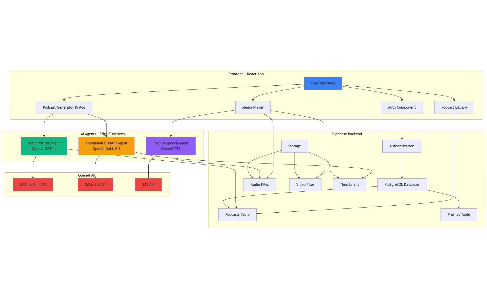

# KT - AI-Powered Podcast Generator

**🚀 Live Demo: https://cf-ai-podcast-generator.pages.dev/**

Generate professional podcasts on any topic in minutes with AI. Perfect for passive learning on the go.

> **📧 Note:** When signing up, check your spam folder if you don't see the confirmation email.  
> **⏳ Note:** After generating your podcast, please wait a few seconds when you click the "Generate Audio" button. Enjoy!

## 📋 Quick Start - Try It Out Now!

Follow these simple steps to create your first podcast:

### Step 1: Sign Up
- Visit [https://cf-ai-podcast-generator.pages.dev/](https://cf-ai-podcast-generator.pages.dev/)
- Click on the sign-up button
- Enter your email and create a password
- You'll receive a confirmation email

### Step 2: Verify Email
- Check your inbox for the confirmation email
- **⚠️ Important:** Check your spam/junk folder if you don't see it in your inbox
- Click the confirmation link to activate your account

### Step 3: Create a Podcast
- Log in to your account
- Click the **"Generate Podcast"** button on the dashboard

### Step 4: Enter Details
- **Topic:** What would you like the podcast to be about?
- **Duration:** How long should it be? (e.g., "5 minutes", "10 minutes")
- **Style:** Choose a style (Educational, Conversational, Storytelling, etc.)
- Click **"Generate"** and wait for the script to be created
- This typically takes a few seconds

### Step 5: Generate Audio
- Once the script is generated, you'll see the podcast card
- Click the **🎵 sound icon** to generate audio narration
- **⏳ Important:** Wait a few seconds for the audio to be processed
- The speaker will use different voices for Host and Interviewer

### Step 6: Play and Enjoy
- Click the **▶️ play button** to start listening
- Listen to your custom-generated podcast
- You can also view the full script while listening
- Share or download your podcast anytime

## 🎯 The Inspiration

Ever been on a flight and wished you could listen to a podcast about a specific topic? Or wanted to learn something new during your commute but couldn't find the right podcast? **KT** solves that problem.

Instead of searching through endless podcast libraries, simply tell us:
- **Topic**: What do you want to learn about?
- **Duration**: How long should the podcast be?
- **Style**: Educational, conversational, storytelling, or any style you prefer

And we'll generate a professional podcast for you **in seconds**—ready to play instantly.

## ✨ How It Works

KT uses three specialized AI agents working together to create end-to-end podcasts:

### 🎬 **Script Writer Agent**
Generates engaging, conversational podcast scripts based on your topic, duration, and preferred style. Creates natural dialogue between hosts and explores key points thoroughly.

### 🖼️ **Thumbnail Creator Agent**
Produces eye-catching, professional podcast artwork using AI image generation. Perfect for sharing and branding your content.

### 🎵 **Text-to-Speech Agent**
Converts the script into high-quality audio narration with different voices for each speaker, creating a dynamic listening experience.

## ️ Technology Stack

**Frontend:**
- React 18 with TypeScript
- Vite for fast development
- Tailwind CSS for styling
- shadcn/ui for components

**Backend:**
- Supabase for database and authentication
- Edge Functions for serverless AI processing
- OpenAI GPT for script generation
- OpenAI DALL-E for thumbnail generation
- OpenAI TTS for audio narration

## 🏗️ Architecture



**Flow:**
1. User creates a podcast request via the UI
2. Script Writer Agent generates the script using OpenAI GPT
3. Thumbnail Creator Agent creates artwork using DALL-E
4. Text-to-Speech Agent converts script to audio using OpenAI TTS
5. All assets are stored in Supabase and displayed in the user's library
6. Media Player streams audio/video directly from Supabase Storage

## 📸 Screenshots

### Architecture Diagram

*System architecture showing how the three AI agents work together*

### Podcast Generation

*Enter your topic, duration, and style to create a custom podcast*

### Podcast Library

*Your generated podcasts organized in a beautiful card layout*

### Media Player

*Play your podcasts with a full-featured audio player showing the script*

## � How to Use

Follow these simple steps to create your first podcast:

### Step 1: Sign Up
- Visit [https://cf-ai-podcast-generator.pages.dev/](https://cf-ai-podcast-generator.pages.dev/)
- Click on the sign-up button
- Enter your email and create a password
- You'll receive a confirmation email

### Step 2: Verify Email
- Check your inbox for the confirmation email
- **⚠️ Important:** Check your spam/junk folder if you don't see it in your inbox
- Click the confirmation link to activate your account

### Step 3: Create a Podcast
- Log in to your account
- Click the **"Generate Podcast"** button on the dashboard

### Step 4: Enter Details
- **Topic:** What would you like the podcast to be about?
- **Duration:** How long should it be? (e.g., "5 minutes", "10 minutes")
- **Style:** Choose a style (Educational, Conversational, Storytelling, etc.)
- Click **"Generate"** and wait for the script to be created
- This typically takes a few seconds

### Step 5: Generate Audio
- Once the script is generated, you'll see the podcast card
- Click the **🎵 sound icon** to generate audio narration
- **⏳ Important:** Wait a few seconds for the audio to be processed
- The speaker will use different voices for Host and Interviewer

### Step 6: Play and Enjoy
- Click the **▶️ play button** to start listening
- Listen to your custom-generated podcast
- You can also view the full script while listening
- Share or download your podcast anytime

## �📖 Development

**Local Development**

Clone this repository and work with your preferred IDE.

The only requirement is having Node.js & npm installed - [install with nvm](https://github.com/nvm-sh/nvm#installing-and-updating)

Follow these steps:

```sh
# Step 1: Clone the repository using the project's Git URL.
git clone <YOUR_GIT_URL>

# Step 2: Navigate to the project directory.
cd <YOUR_PROJECT_NAME>

# Step 3: Install the necessary dependencies.
npm i

# Step 4: Start the development server with auto-reloading and an instant preview.
npm run dev
```

**Edit a file directly in GitHub**

- Navigate to the desired file(s).
- Click the "Edit" button (pencil icon) at the top right of the file view.
- Make your changes and commit the changes.

**Use GitHub Codespaces**

- Navigate to the main page of your repository.
- Click on the "Code" button (green button) near the top right.
- Select the "Codespaces" tab.
- Click on "New codespace" to launch a new Codespace environment.
- Edit files directly within the Codespace and commit and push your changes once you're done.

## What technologies are used for this project?

This project is built with:

- Vite
- TypeScript
- React
- shadcn-ui
- Tailwind CSS

## Deployment

This project can be deployed to any platform that supports React/Vite applications:

- Vercel
- Netlify
- Cloudflare Pages
- AWS Amplify
- Or any static hosting service

Make sure to configure the environment variables (`VITE_SUPABASE_URL`, `VITE_SUPABASE_PUBLISHABLE_KEY`) in your deployment platform.
